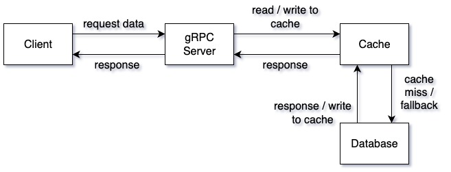

# DBCache
A lightweight gRPC-based caching service to reduce database load and improve response times.

## Overview / Motivation
The idea of a DB cache is to reduce database load by serving cached data when available.

I built this to explore gRPC in a real-world context as applied to databases.

## Architecture Diagram



## Features
- gRPC API with a REST gateway for local development/testing.
- Developers can plug in any database or cache by implementing the provided datastore interfaces.
- Metrics via Prometheus.

## Quickstart / Installation
### Usage
Starting this app should be done through the makefile.
If starting for the first time run:
```
make build-dbs
```
For local dev, it's most likely easier to use the HTTP gateway that sits on top of the gRPC api gateway. That way one can use the easily use the Bruno collection in this repo.
```
make run-dbs
make run-dev
```
### Config
Most, if not all, environment variables are done via dbcache.env. Credentials are not securely managed in this repo as it is intended for local development at this point.
### Testing
Unit test coverage is minimal due to boilerplate, integration tests cover core behavior.
```
make tests
```
The Bruno collection also has tests that assert on expected values.

## Other
Please see the github wiki for additional information.

